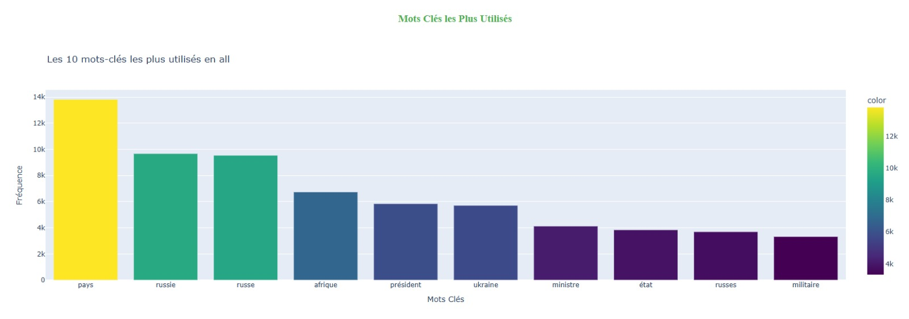
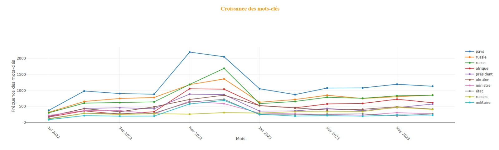
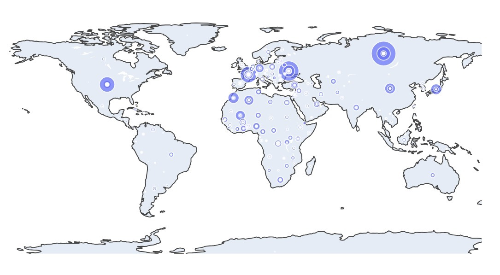

# Plotly Project

## Project Overview
This project is a data visualization dashboard built with Plotly and Dash, designed to analyze and display trends and patterns in a corpus of pre-processed online media articles. The project includes Python scripts for multiprocessing and initial graphical exploration, as well as a PDF document outlining the project's description.

### Features:
- **Bar Chart:** Displays the 10 most frequently mentioned keywords.
- **Correlation Matrix:** Shows the Pearson correlation between keywords.
- **Line Chart:** Analyzes the temporal growth of the 10 most frequent keywords.
- **Location Map:** Visualizes the frequency of mentions by country.

## Project Structure
```plaintext
├── /Dashboard
│   ├── dashboard.py          # Generates bar chart, correlation matrix, and line chart
│   ├── location_map.py       # Generates map of location frequencies
├── /Fichiers-Python-20241108
│   ├── multiprocessing_files # Python scripts for parallel processing
│   ├── print_structure.py    # Helps understand JSON structure
├── /Les Premiers Graphiques   # Initial graphical explorations
├── project-description.pdf   # Detailed project overview
├── README.md                 # Project documentation
```

## Data Overview
The dataset is not included in the repository due to its size. Below is the structure and description of the JSON files required to run the code:

### Metadata Structure
```plaintext
metadata
├── all
│   ├── kws       # Keywords: dict with 15,433 keys
│   ├── loc       # Locations: dict with 3,284 keys
│   ├── org       # Organizations: dict with 2,780 keys
├── year
│   ├── 2022
│       ├── kws   # Keywords: dict with 15,433 keys
│       ├── loc   # Locations: dict with 3,284 keys
│       ├── org   # Organizations: dict with 2,780 keys
├── month
    ├── 2022
        ├── 12
        │   ├── kws  # Keywords: dict with 10,485 keys
        │   ├── loc  # Locations: dict with 1,997 keys
        │   ├── org  # Organizations: dict with 1,532 keys
        ├── 11
            ├── kws  # Keywords: dict with 10,241 keys
            ├── loc  # Locations: dict with 1,848 keys
            ├── org  # Organizations: dict with 1,588 keys
```

#### Description:
- **`kws`**: Dictionary mapping keywords to their frequency.
- **`loc`**: Dictionary mapping locations to their frequency.
- **`org`**: Dictionary mapping organizations to their frequency.

### Data Structure
```plaintext
data
├── 2022
    ├── 12
    │   ├── 9  # Array of articles
    │   │   ├── dict_keys(['timestamp', 'url', 'title', 'description', 'content', 'content-segmented', 'kws-l', 'loc-l', 'org-l', 'per-l', 'kws', 'loc', 'org', 'per'])
    │   ├── 10  # Array of articles
    │   │   ├── dict_keys(['timestamp', 'url', 'title', 'description', 'content', 'content-segmented', 'kws-l', 'loc-l', 'org-l', 'per-l', 'kws', 'loc', 'org', 'per'])
    │   ├── dict with 30 keys (days of the month)
    ├── 11
        ├── 9  # Array of articles
        │   ├── dict_keys(['timestamp', 'url', 'title', 'description', 'content', 'content-segmented', 'kws-l', 'loc-l', 'org-l', 'per-l', 'kws', 'loc', 'org', 'per'])
        ├── dict with 30 keys (days of the month)
```

## Dependencies
- Python
- Plotly
- Dash
- Pandas
- Other standard Python libraries

## How to Use
1. **Install Dependencies:**
   ```bash
   pip install plotly dash pandas
   ```
2. **Prepare the Dataset:**
   - Place the `metadata` and `data` JSON files in the appropriate directory.
3. **Run the Dashboard:**
   ```bash
   python dashboard/dashboard.py
   ```
4. **Explore Initial Graphics:**
   - Run the scripts in `Les Premiers Graphiques` for preliminary visualizations.

## Screenshots

### Bar Chart


### Correlation Matrix


### Line Chart


### Location Map


## Contributions
Feel free to fork the repository and submit pull requests for improvements or additional features.

## License
This project is licensed under [MIT License](LICENSE).
